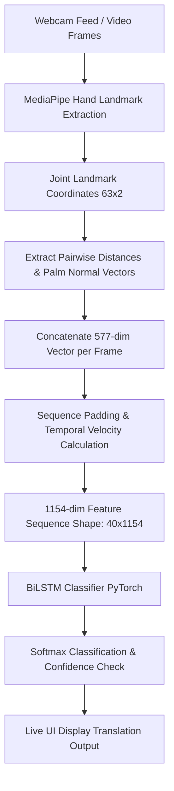

# Indian Sign Language (ISL) Gesture Recognition System

A real-time Indian Sign Language (ISL) gesture recognition system utilizing MediaPipe for joint-landmark and hand feature extraction, PyTorch for BiLSTM-based sequence prediction, a FastAPI WebSocket backend, and a modern React + Vite + Tailwind CSS frontend wrapped in an Electron desktop application.

---

## 🚀 Key Features

* **Real-time Inference**: Capture hand movements via webcam and translate them instantly with extremely low latency.
* **Dual Interface Support**:
  * **Desktop App**: Electron desktop app wrapper launching the FastAPI server and Vite frontend automatically.
  * **Python CLI**: Run live inference directly from your terminal using OpenCV.
* **Hand Feature Extraction Model**:
  * Extracts **577 features per frame**: Joint coordinates (relative to wrist), pairwise joint distances, palm normal vector, and cross-hand fingertip distances.
  * Captures temporal dynamics by calculating velocity (frame differences), resulting in a **1154-dimensional feature vector** per frame.
* **LSTM Classifier**: Sequence model trained with PyTorch (`BiLSTM`) containing bidirectional layers to classify sign language gestures.
* **Custom Dataset Recorder**: Built-in CLI tool to capture sequences of gestures, compile custom datasets, and save them as NumPy (`.npy`) format.

---

## 📁 Repository Structure

```tree
├── backend/                  # FastAPI WebSocket server & PyTorch model wrapper
│   ├── main.py               # WebSocket endpoint for real-time video frames
│   ├── model.py              # Feature extraction helper & BiLSTM definition
│   └── requirements.txt      # Backend dependencies
├── dataset/                  # Saved .npy sequence data (organized by word)
├── electron/                 # Electron main and preload JS files
├── frontend/                 # React + Vite web dashboard
├── package.json              # Main desktop application configuration & scripts
├── requirements.txt          # Global python dependencies
├── record_sequence.py        # CLI dataset recording script
├── train_model.py            # PyTorch training loop script for the BiLSTM
└── live_inference.py         # Terminal-based live OpenCV inference script
```

---

## 🛠️ Prerequisites

Make sure you have the following installed on your machine:
* [Node.js](https://nodejs.org/) (v18 or higher recommended)
* [Python 3.10+](https://www.python.org/downloads/) (PyTorch & MediaPipe compatible)
* A working webcam

---

## 📦 Installation & Setup

### 1. Clone the Repository
```bash
git clone https://github.com/ekagrazi/Disability_Aid_ISL_Gesture_Recognition.git
cd Disability_Aid_ISL_Gesture_Recognition
```

### 2. Python Environment Setup
Create a virtual environment and install the required Python packages:

```bash
# Create a virtual environment
python -m venv .venv

# Activate it (Windows)
.venv\Scripts\activate

# Activate it (macOS/Linux)
source .venv/bin/activate

# Install the dependencies
pip install -r requirements.txt
```

### 3. Node.js Environment Setup
Install Node modules for the root directory (Electron & utilities) and the React frontend:

```bash
# Install dependencies
npm install
cd frontend
npm install
cd ..
```

---

## 🏃 Running the Application

### Option A: Running the Desktop Application (Recommended)
This launches the FastAPI backend, the React frontend, and the Electron desktop frame concurrently.

To run in **Development Mode**:
```bash
# Make sure your python virtual environment is activated
npm run dev
```

To **Build & Package** the application for distribution:
```bash
npm run build
```
This builds the backend executable with `pyinstaller`, bundles the frontend code, and packages the Electron app inside the `release/` directory.

---

### Option B: Running the Web App & Server Separately
If you prefer running the web interface in a standard web browser:

1. **Start the FastAPI Backend**:
   ```bash
   npm run dev:backend
   # Or run manually: python backend/main.py
   ```
2. **Start the React Frontend**:
   ```bash
   npm run dev:frontend
   # Or run manually: cd frontend && npm run dev
   ```
3. Open `http://localhost:3000` in your web browser.

---

### Option C: Python CLI Tools (Dataset Recording & Direct Inference)

#### 🎥 Recording Custom Sign Gesture Dataset
Collect sequences of coordinates for new words to train the model:
1. Run the recording script:
   ```bash
   python record_sequence.py
   ```
2. Enter the label/word you wish to record (e.g., `Hello`).
3. Position your hands in front of the camera.
4. Press the **Spacebar** to toggle recording on/off for each sample sequence (capture 30 samples).
5. Data is structured and saved under the `dataset/` directory.

#### 🏋️ Training the Model
Train the neural network on your custom dataset:
```bash
python train_model.py
```
This trains the model over 50 epochs and saves the weights and classes list to `slr_model.pth`.

#### 👁️ Local Live Inference
Test the trained model weights immediately via terminal without starting the web servers:
```bash
python live_inference.py
```
*(Press `ESC` to exit the video display).*

---

## 🧠 Technical Pipeline


---
*Created with love to bridge communication gaps.*
